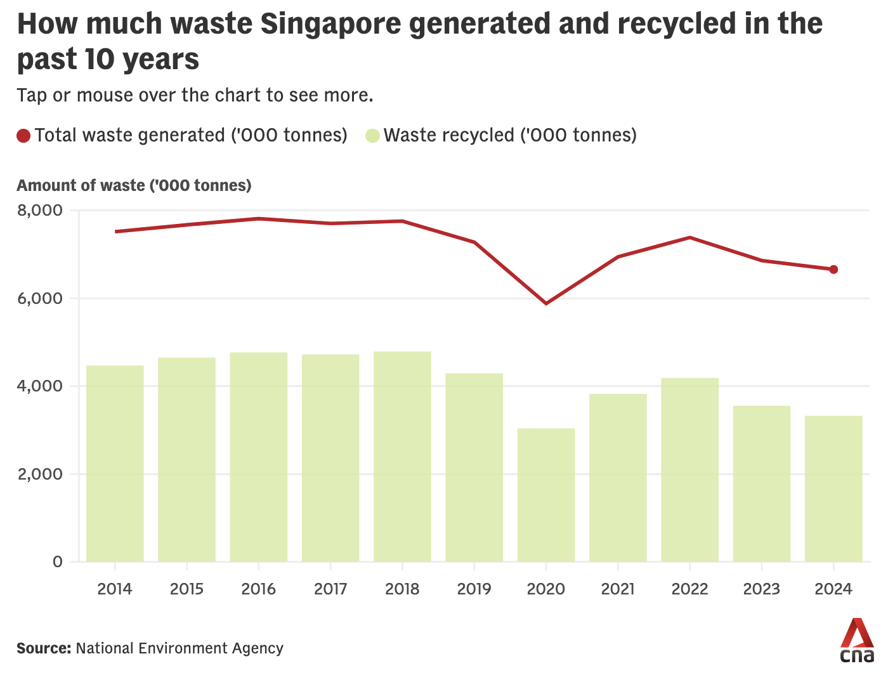

```{=html}
<div id="custom-title-banner">
  <h1 class="custom-title">Two Worlds of Waste: What Singapore&rsquo;s Recycling Rate Hides</h1>
  <p class="custom-subtitle">AAI1001 Team Project Proposal</p>
  <div class="custom-author-block">
    <span class="custom-author-heading">Author</span>
    <span class="custom-author-name">AAI1001 Team 1</span>
  </div>
  
</div>
```

# Team Information
| Name | Student ID |
|---|---|
| Timothy Chia Kai Lun | 2501530 |
| Dalton Chng Cheng Hao | 2504003 |
| Pham Anh Bao Khang | 2503012 |
| Sitt Min Naing | 2502873 |
| Ang Ben Rong | 2503508 |

::: {.snapshot-grid}
::: {.snapshot-card}
<span class="snapshot-label">Story focus</span>
<span class="snapshot-value">Two worlds of waste</span>
<span class="snapshot-note">Industrial recycling strength vs consumer-facing disposal burden</span>
:::

::: {.snapshot-card}
<span class="snapshot-label">Default view</span>
<span class="snapshot-value">2024</span>
<span class="snapshot-note">CNA and NEA anchor year</span>
:::

::: {.snapshot-card}
<span class="snapshot-label">Time range</span>
<span class="snapshot-value">2014–2024</span>
<span class="snapshot-note">Restores the decade trend from the original chart</span>
:::

::: {.snapshot-card}
<span class="snapshot-label">Final chart</span>
<span class="snapshot-value">Interactive bubble map</span>
<span class="snapshot-note">Year slider, hover tooltips, reference line, and action area</span>
:::
:::

# 1. Introduction and Project Overview {#sec-overview}

## 1.1 Project aim

Singapore’s waste statistics present an apparent tension. On one hand, total waste generation has fallen compared with a decade ago, suggesting progress in waste reduction. On the other hand, CNA reported that Singapore’s national recycling rate reached a ten-year low of [**50%**]{.stat .stat-drop} in 2024, down from [**60%**]{.stat .stat-reference} in 2014. NEA’s 2024 figures also show that Singapore generated about [**6.66**]{.stat .stat-volume} million tonnes of solid waste, of which about [**3.33**]{.stat .stat-recycling} million tonnes was recycled.

The deeper issue is that the national recycling rate compresses two different waste systems into one headline number. High-recycling industrial streams such as ferrous metal, construction and demolition waste, used slag, and non-ferrous metal account for much of Singapore’s recycled tonnage. In contrast, the disposal burden is concentrated in priority waste streams such as plastic, paper/cardboard, and food which CNA and NEA identify as major contributors to waste that is not recycled. This means “Singapore recycled less” is true at the national level, but the headline can obscure whether the decline reflects changes in high-volume industrial material flows, specific material-stream pressures, or everyday recycling behaviours.

The original CNA chart communicates the broad national trend clearly, but it remains an aggregate view. It shows how much waste was generated and recycled over time, but it does not show how recycling contribution and disposal burden are split across different streams. This limits its usefulness as an explanatory and decision-support visualisation.

Our project therefore aims to redesign the original chart into an **interactive 2014–2024 waste-stream priority map**, opening on 2024 as the CNA article's anchor year. The planned visualisation shifts the focus from national totals alone to the relationship between **waste generated**, **recycling rate**, and **waste disposed** across individual waste streams in a selected year. The goal is not only to identify weakly recycled streams, but to reveal the composition paradox behind the national rate: the streams that make recycling look strong are not necessarily the streams that create the largest disposal problem.

::: {.callout-note}
**Core argument:** Singapore’s recycling headline combines two different waste-management patterns. High-recycling industrial streams dominate recycled tonnage, while food, paper/cardboard, and plastics dominate the waste that is not recycled. A useful redesign should make this split visible rather than treating the national recycling rate as one simple behaviour story.
:::

Preliminary figures from the local Data.gov.sg CSV support this split: in 2024, plastic, paper/cardboard, and food account for about [**72%**]{.stat .stat-disposal} of disposed waste, while four industrial streams account for roughly two-thirds of recycled tonnage. The full motivating evidence is summarised in Section 6 before the planned analyses.

Specifically, our proposal is guided by three questions:

::: {.question-list}
1. **Which waste streams generated the largest volumes in the selected year, especially in the 2024 default view?**

2. **Which streams sit below the selected year's national recycling reference rate, with 2024's 50% rate as the starting point?**

3. **Which streams combine high volume, low recycling rate, and high disposal impact over time, and what does this reveal about the split between industrial recycling strength and consumer-facing disposal burden?**
:::

<!-- The redesign aims to make the CNA story more informative by showing how recycling and disposal are distributed across waste streams. In particular, the planned chart should help distinguish large but well-recycled industrial streams, such as ferrous metal and construction and demolition waste, from large streams with much weaker recycling performance, such as plastic, food, and paper/cardboard. This gives different audiences a clearer basis for action: policymakers can see why the national rate is sensitive to industrial composition, companies can target waste streams linked to their operations, and residents can better understand how everyday choices, contamination, and recycling habits connect to the focus streams highlighted by NEA. -->

The redesign therefore separates two related but different stories: the decade decline in national recycling rate is largely explained by reduced volumes of almost fully recycled industrial streams, while the 2024 priority map highlights the waste streams that contribute most to current disposal burden.

## 1.2 Source & Context

The original visualisation was published by **CNA** in a news article titled *“Singapore generated less waste and recycled less in 2024”* (23 July 2025), available at:

> <https://www.channelnewsasia.com/singapore/waste-recycling-rates-domestic-statistics-nea-2024-5253106>

The article reports Singapore’s 2024 waste and recycling statistics, including the national recycling rate falling to a ten-year low of **50%**. It also summarises NEA’s explanation that reductions in high-recycling industrial streams, especially construction and demolition waste and used slag, contributed to the lower overall recycling rate.

The underlying data for our planned redesign comes from the **Data.gov.sg / SingStat** dataset [*“Waste Management And Overall Recycling Rates, Annual”*](https://data.gov.sg/datasets/d_daf568968ab40dc81e7b08887a83c8fa/view). The dataset’s stated source is the **Ministry of Sustainability and the Environment** and the **National Environment Agency**. It covers annual waste statistics from **2000 to 2024**, including generated waste, recycled waste, disposed waste, and recycling rates by waste stream.

## 1.3 Our Chosen Visualisation

{fig-align="center" width="85%"}

### 1.3.1 Visualisation Structure and Design

The selected visualisation is a single line-and-bar chart titled **“How much waste Singapore generated and recycled in the past 10 years”**. It presents Singapore’s national waste trend from **2014 to 2024** using two measures:

- **Total waste generated**: shown as a red line.
- **Waste recycled**: shown as light green vertical bars.

Both measures are plotted on the same y-axis and use the same unit, **'000 tonnes**. This makes the chart easy to read as a national summary: viewers can compare the amount of waste generated with the amount recycled in each year.

The original chart also offers a very basic interactive element: hovering over a given year reveals a small tooltip window showing that year's total waste generated, waste recycled, waste disposed of, and the overall recycling rate. This interaction is limited to a simple year-by-year lookup, however, and does not allow viewers to compare individual waste streams or categories, which is one of the gaps our redesign addresses.

{fig-align="center" width="85%"}

### 1.3.2 The Story It Tells

The chart tells a simple but important story: Singapore generated less waste in 2024 than in the mid-2010s, and the amount recycled also declined. This supports CNA’s article-level claim that Singapore generated less waste and recycled less in 2024.

The broad pattern is visible at a glance. Total generated waste generally trends downward across the decade, while recycled waste remains consistently below generated waste. The chart also makes the 2020 dip visible, followed by a rebound and then another decline towards 2024.

### 1.3.3 Why This Chart is a Suitable Starting Point

This CNA chart is a suitable starting point because it is a single quantitative visualisation from online news media and is directly linked to a public dataset. It is also clear enough to communicate the national trend, which means our redesign does not need to replace the topic. Instead, it can extend the explanation.

The main opportunity is that the original chart remains at the aggregate level. It does not show whether the fall in recycling is driven by consumer-facing streams, industrial streams, or changes in the composition of waste generated. Our proposed redesign therefore keeps the same broad waste-management story but changes the analytical focus from **national totals over time** to **stream-level action areas over time** and the hidden split between recycled tonnage and disposed waste.

::: {.no-icon}
# 2. Critical Analysis of Original Visualisation {#sec-critique}

## 2.1 Strengths
[What works well]{.section-subtitle}

::: {.callout-tip}
## **S1** Low visual complexity
The chart uses only two visual series, total waste generated and waste recycled. This reduces cognitive load and makes the main comparison easy to follow. For a news audience, the restrained design helps readers focus on the relationship between generated and recycled waste without being distracted by too many encodings.
:::

::: {.callout-tip}
## **S2** Common unit and scale
Both generated and recycled waste are shown in **'000 tonnes** on the same vertical scale. This is useful because viewers can compare the two quantities directly, rather than switching between different units or axes.
:::

::: {.callout-tip}
## **S3** Clear national trend
The red line makes the long-term movement in total generated waste visible. Readers can see that waste generation in 2024 is lower than in much of the mid-2010s, which supports the article’s point that waste generation has generally trended down over the past decade.
:::

::: {.callout-tip}
## **S4** Familiar chart type
The combination of a line and bars is a conventional news-graphic format. The red line naturally draws attention to the overall trend, while the bars provide year-by-year values for recycled waste. This makes the chart approachable and quick to scan.
:::

## 2.2 Weaknesses
[What limits the story]{.section-subtitle}

::: {.callout-important}
## **W1** Recycling rate is absent
CNA’s article highlights that the national recycling rate fell to a ten-year low of **50%** in 2024, but the chart does not plot recycling rate directly. Readers must infer recycling performance from the distance between generated and recycled amounts, which makes the article’s key metric less immediate than it should be.
:::

::: {.callout-important}
## **W2** Waste-stream composition is hidden
The chart aggregates all waste streams into national totals. This hides important differences between categories. For example, ferrous metal and construction and demolition waste are large streams with very high recycling rates, while plastic, food, and paper/cardboard have much weaker recycling performance. These differences matter because the streams that dominate recycled tonnage are not necessarily the same streams that dominate disposal.
:::

::: {.callout-important}
## **W3** It describes what happened, but gives limited actionable insight
The chart shows that total generated waste and total recycled waste changed over time, but it does not help readers identify which waste streams create the largest disposal burden. As a result, the visualisation is useful as a summary but less useful for guiding action. Businesses may not know which waste streams to target through operational initiatives, and everyday residents may not know which material behaviours are most relevant to improving recycling outcomes. It also leaves open an important interpretation question: whether a lower national recycling rate reflects weaker recycling behaviour, less recyclable industrial material being generated, or both.
:::

::: {.callout-important}
## **W4** Visual emphasis favours generated waste
The red generated-waste line is visually stronger than the pale green recycled-waste bars. This makes total waste generation feel like the dominant story, even though the article also emphasises weak recycling performance and the fall in recycling rate.
:::

::: {.callout-important}
## **W5** Important benchmarks and annotations are missing
The chart does not annotate the 2024 recycling-rate low, the 50% national recycling reference rate, or the role of high-recycling streams such as construction and demolition waste and used slag. Without these cues, readers may see the pattern but miss the reasons why it matters.

Overall, the CNA chart works well as a broad news summary, but its aggregate framing leaves readers without enough detail to understand the category-level pattern behind the national totals or the practical actions suggested by the data.
:::
:::

# 3. Proposed Improvements: From National Trend to Two Worlds of Waste {#sec-improvements}

Based on the weaknesses identified in Section 2, our redesign plan changes the reading task. The CNA chart is useful for seeing the national trend, but our proposed visualisation asks a more targeted question: which waste streams explain the split between recycling strength and disposal burden, and how does that split change from 2014 to 2024? This pivot is intentional. A decade-long national trend explains what happened overall, while an interactive waste-stream priority map helps explain where action could be focused and why the national recycling rate alone can be misleading.

The improvements below therefore keep the original topic and evidence base, but adapt the chart form to support the project story rather than following the original format too closely.

|ID | Weakness addressed | Improvement | Method / Technique |
|-|--|---|---|
|**W1**|Recycling rate is absent | Make recycling performance directly visible instead of requiring readers to infer it from two totals. | Use **recycling rate in the selected year** as the y-axis and add a dynamic horizontal reference line at that year's national recycling rate, opening at **50%** for 2024. |
|**W2**|Waste-stream composition is hidden | Move from national totals to waste-stream-level comparison so readers can see which categories behave differently and whether recycling and disposal are concentrated in different streams. | Reshape the Data.gov.sg table into a stream-year dataset and plot one bubble for each waste stream in the selected year. |
|**W3**|Limited actionable insight | Show which streams combine large generated volume, weak recycling performance, and high disposal impact. | Use generated waste on the x-axis, recycling rate on the y-axis, disposed waste as bubble size, and a shaded selected-year action area. |
|**W4**|Visual emphasis favours generated waste | Balance attention across volume, recycling performance, disposal burden, and the two-worlds category split. | Use a bubble priority map where position, size, year, and colour each encode a different aspect of waste performance. |
|**W5**|Important reference points and annotations are missing | Add visual cues that help readers interpret the chart without reading the full dataset. | Add a selected-year reference line, a shaded high-volume low-recycling area, selected stream labels, legends, hover tooltips, and source attribution. |

## 3.1 Planned visualisation specification

The planned improved chart is an **interactive 2014–2024 bubble priority map** titled:

::: {.chart-title-showcase}
<span class="chart-title-kicker">Planned chart</span>
<span class="chart-title-main">Two Worlds of Waste, 2014–2024: <span class="chart-title-recycling">Recycling Strength</span> <span class="chart-title-vs">vs</span> <span class="chart-title-disposal">Disposal Burden</span></span>
:::

The chart opens on **2024**, because this is the year highlighted by CNA and NEA, but a Plotly year slider or animation control will allow viewers to move across **2014–2024**. The chart uses one bubble per waste stream in the selected year and remains a single plot. A bubble chart is suitable because it allows volume, recycling performance, disposal burden, and waste-system category to be compared in one view without turning the redesign into a dashboard.

| Dimension | Planned encoding | Purpose |
|---|---|---|
| Waste stream | Direct label and hover tooltip | Identifies each bubble; supports reading but is not counted among the four encoded dimensions. |
| Year | Plotly slider or animation frame, defaulting to 2024 | Restores the decade trend from the original CNA chart while keeping stream-level detail. |
| Waste generated in selected year | x-axis | Shows the scale of each stream. |
| Recycling rate in selected year | y-axis | Makes recycling performance explicit. |
| Disposed waste in selected year | Bubble size | Shows disposal burden, not just generated volume. |
| Waste-system category | Bubble colour | Makes the two-worlds split visible by separating consumer-facing, industrial, organic/landscape, and process/other streams. |
| National reference rate | Dynamic horizontal reference line for the selected year | Compares each stream against the selected year's national recycling rate without implying that the aggregate rate is an equal target for every material stream. |
| Action area | Shaded selected-year region | Highlights streams with high generated volume and below-reference recycling rate. |
| Exact values on demand | Hover tooltip | Reveals generated, recycled, and disposed waste; recycling rate; disposal share; recycling share; rate gap; and priority group without cluttering the chart. |

The national recycling-rate line is treated as a reference rather than a target because recyclability differs structurally across materials. Metals and construction streams can approach near-full recovery, while food waste and some plastics face different contamination, collection, and processing constraints. If the year changes, the reference line should change with it, so 2014 uses the 2014 national recycling rate while 2024 uses the 2024 rate of 50%.

Although disposed waste is derived from generated waste and recycling performance, it is encoded directly because it represents the practical outcome that policy and behaviour must act on: the amount of waste still requiring disposal.

Colour will encode broad waste-system category, not priority group. This better supports the core story because the viewer can immediately see whether everyday-material or industrial streams occupy the high-disposal, low-recycling area. The “two worlds” contrast is carried primarily by spatial position and bubble size, while the four-category colour scheme adds finer composition detail on top: everyday-material streams are expected to concentrate in the high-disposal, lower-recycling area, while industrial/construction streams are expected to cluster in the high-recycling area. Priority remains visible through spatial position, the shaded action area, and the hover tooltip.

| Waste-system category | Streams |
|---|---|
| Everyday materials | Food, Plastic, Paper/Cardboard, Glass, Textile/Leather |
| Industrial/construction | Construction & Demolition, Ferrous Metal, Non-Ferrous Metal, Used Slag, Scrap Tyres |
| Organic/landscape | Horticultural, Wood |
| Process/other | Ash And Sludge, Others |

The priority grouping rules below are a transparent starting point. They may be refined during implementation if the final distribution of waste streams suggests a clearer threshold.

::: {.priority-rules-table}
| Group | Rule | Intended interpretation |
|---|---|---|
| High action area | Generated volume above the selected-year stream median and recycling rate below the selected-year national reference rate | Large streams with below-reference recycling performance. |
| Disposal concern | Recycling rate below the selected-year national reference rate, but generated volume below the selected-year median | Low-rate streams that still create disposal concerns. |
| Higher recycling | Recycling rate at or above the selected-year national reference rate | Streams performing at or above the national reference rate for that year. |
:::

The median generated-volume threshold is used as an initial transparent rule rather than an arbitrary visual cut-off. In the interactive version, both the threshold and national reference rate should be calculated within each selected year, so the shaded action area and priority labels remain consistent with the visible frame.

Because colour carries the waste-system category dimension, the planned palette should use a colour-blind-safe scheme such as the Okabe–Ito / Wong (2011) qualitative palette rather than a default palette. Colour should not be the only cue: the reference line, shaded action area, direct labels, and hover tooltip should allow the chart to remain interpretable even when colours are difficult to distinguish. The full palette reference is given in Section 8.4.

The implementation may use `ggplot2` for the base chart and `plotly` for the year slider, or use `plotly` directly if that gives better control over animation frames and hover text. The core design should still work as a static 2024 view for non-interactive export through clear axes, labels, reference lines, and source attribution. If a dynamic reference line proves technically difficult in the animated version, the fallback will keep the 2024 static line clearly labelled and report selected-year national rates in tooltips or annotations. This keeps the proposal flexible while preserving the main visualisation objective. As this is a proposal, these improvements define the planned direction rather than a binding final implementation; thresholds, labels, and tooltip fields may be refined during the final build if the cleaned data distribution suggests a clearer design.

::: {.feature-grid}
::: {.feature-card}
<p class="eyebrow">Design choice</p>

#### Why a bubble priority map?
A bubble map lets the reader compare generated volume, recycling rate, disposed waste, and waste-system category in one view without turning the proposal into a dashboard.
:::

::: {.feature-card}
<p class="eyebrow">Story choice</p>
#### Why keep the 2014–2024 slider?
The slider preserves CNA’s decade story while adding stream-level detail. It helps show whether the national rate changed because of consumer-facing streams, industrial streams, or both.
:::

::: {.feature-card}
<p class="eyebrow">Interpretation cue</p>
#### Why use a national reference line?
The reference line makes the selected-year national recycling rate visible immediately, while avoiding the stronger claim that every material stream should meet the same target.
:::

::: {.feature-card}
<p class="eyebrow">Accessibility cue</p>
#### Why avoid colour-only interpretation?
Colour shows waste-system category, but labels, position, bubble size, the shaded action area, and tooltips also carry meaning. This keeps the chart readable for more viewers.
:::
:::

## 3.2 Why this redesign supports the story

The proposed chart changes the reading task from tracking two national totals to comparing waste-stream profiles over time. The main audience is general news readers and policy-aware public audiences who need a quick but evidence-based view of which waste streams deserve attention. Different audiences need different forms of actionable insight. Businesses can identify streams linked to operational waste, residents can recognise which everyday material streams are associated with low recycling performance, and policymakers can see that the national recycling rate is strongly shaped by industrial waste composition rather than reading it as a simple household recycling score.

The redesign keeps the CNA chart's accessibility by using clear labels and familiar quantity measures. It extends the chart by adding stream-level detail, recycling-rate visibility, disposal impact, broad waste-system category, and a year slider. The planned chart is expected to distinguish large but well-recycled industrial streams, such as ferrous metal and construction/demolition waste, from large lower-recycling consumer-facing streams, such as plastic, food, and paper/cardboard. As viewers move through 2014–2024, the chart should make the “two worlds” pattern visible: recycling success and disposal burden can sit in different parts of the waste system, and changes in industrial material flows can shift the national rate without telling the whole consumer-facing disposal story.

## 3.3 Original strengths preserved

The redesign is intended to fix the weaknesses in Section 2.2 without discarding what already works in the CNA chart. The following original strengths are deliberately carried over:

- **S1 (Low visual complexity):** the improved chart stays a single plot with a small set of encodings, rather than becoming a dashboard or a collection of panels.
- **S2 (Common unit and scale):** waste amounts remain in **'000 tonnes**, matching the CNA convention, which keeps the x-axis and bubble-size legend easy to read.
- **S3 (Clear national trend):** the year slider restores the decade view from the original chart while adding stream-level detail. The 2024 national recycling rate remains the default reference line, and the selected-year reference line allows viewers to compare streams against the national rate for any year in the 2014–2024 range.
- **S4 (Familiar chart type):** a labelled bubble chart with a year slider is still a conventional, quick-to-scan format, so the redesign does not impose an unfamiliar reading task on a general audience.

This mapping makes the redesign a targeted improvement on the original rather than an unrelated replacement: each weakness in Section 2.2 is addressed, while each strength above is retained.

# 4. Data Sources and Data Quality {#sec-data}

Our improved priority map uses the official waste statistics that sit behind CNA’s national waste story, accessed through Data.gov.sg / SingStat. The redesign remains grounded in the same public evidence base while adding the stream-year detail needed to identify priority areas and show how they change from 2014 to 2024.

## 4.1 Selected dataset

| Field | Details |
|---|---|
| Dataset role | Primary dataset |
| Name | Waste Management And Overall Recycling Rates, Annual |
| Platform | Data.gov.sg / SingStat |
| Dataset ID | `d_daf568968ab40dc81e7b08887a83c8fa` |
| Source URL | <https://data.gov.sg/datasets/d_daf568968ab40dc81e7b08887a83c8fa/view> |
| Local data file | `data/waste_management.csv` |
| Stated source | Ministry of Sustainability and the Environment; National Environment Agency |
| Coverage | 2000–2024 |
| Frequency | Annual |
| Raw format | Wide table with metric blocks arranged by row and years arranged by column |
| Units | Tonnes for waste amounts; percentage points for recycling rates |
| Planned chart use | Derive 2014–2024 stream-year generated, recycled, disposed, recycling-rate, category, and reference-rate values for the interactive priority map |
| Planned analysis use | Retain 2014–2024 values for trend checks, disposal ranking, and stream-level comparison |
| Access date | 17 June 2026 |

## 4.2 Justification for dataset selection

This dataset was selected because it directly supports the redesign rather than only providing background context.

##### **It preserves continuity with the CNA story**
The dataset covers the same topic as CNA’s chart: Singapore’s annual waste generation, recycling, disposal, and recycling rates. Using the official NEA-linked source keeps the redesigned visualisation comparable with the original news chart.

##### **It resolves the aggregate-total limitation**
The CNA chart shows national totals only. This dataset contains both national totals and waste-stream categories in the same source, allowing the redesign to show plastic, food, paper/cardboard, metal, construction and demolition waste, and other streams separately.

##### **It supports a single chart with multiple dimensions**
The final plotting table can encode waste stream, selected year, generated waste, recycling rate, disposed waste, and waste-system category in one visualisation. These fields are sufficient for the planned interactive bubble priority map.

##### **It supports the planned analysis beyond the 2024 snapshot**
Although the improved chart opens on 2024, the 2000–2024 coverage allows the team to animate the 2014–2024 period used by the CNA article and compare selected streams across the decade.

::: {.callout-note}
**Minimum dimension requirement (≥ 4):** The project requires at least four dimensions in the final visualisation. The planned chart uses four encoded visual dimensions, each with its own axis or legend: generated waste (x-axis), recycling rate (y-axis), disposed waste (bubble size), and waste-system category (colour), plus an animated year axis via the slider. Each bubble identifies its waste stream directly, and hover tooltips add exact values, shares, rate gap, and priority group. This satisfies and exceeds the four-dimension minimum.
:::

## 4.3 Raw data structure and known challenges

The raw table has one row per data series and one column per year. It is not initially tidy. The year columns run from **2024** backwards to **2000**, and the row order groups the table into four metric blocks, each introduced by a labelled total row:

```text
Row 1        : Header (DataSeries, 2024, 2023, ..., 2000)
Rows 2–16    : Total Generated  + 14 waste streams
Rows 17–31   : Total Recycled   + 14 waste streams
Rows 32–46   : Total Disposed   + 14 waste streams
Rows 47–61   : Recycling Rate   + 14 waste streams
Columns      : DataSeries, 2024, 2023, ..., 2000
```

Within each block, the first row is the national total (`Total Generated`, `Total Recycled`, `Total Disposed`, or `Recycling Rate`) and the remaining rows are individual waste streams such as construction and demolition, ferrous metal, paper/cardboard, food, textile/leather, plastic, and others. Each block can therefore be identified by detecting these four total-row labels in the `DataSeries` column and assigning the corresponding metric to every row beneath, down to the next total row. This label-based detection is preferred over fixed row numbers because it still works correctly even if a future dataset release adds or removes a waste stream. The table must be reshaped from wide metric blocks into tidy year × waste stream records before it can be used for plotting or analysis.

This raw structure creates several cleaning challenges, especially metric classification, stream-name standardisation, numeric parsing, and handling missing recycling-rate values.

### 4.3.1 Identified data quality and structure issues

The table below summarises the main issues that could affect the accuracy or reproducibility of the cleaned dataset. Each issue is included because it could change how waste streams are classified, joined, calculated, or displayed in the final priority map if left untreated. The planned resolutions will be incorporated into the cleaning workflow described in Section 5.

| Issue | Impact on project | Severity | Planned resolution |
|---|---|---|---|
| The dataset is arranged as metric blocks rather than tidy records. | Generated, recycled, disposed, and rate values could be mixed if metric labels are assigned incorrectly. | High | Detect the four total-row labels (`Total Generated`, `Total Recycled`, `Total Disposed`, `Recycling Rate`) in the `DataSeries` column and assign the corresponding metric to each row before reshaping, rather than relying on fixed row numbers. |
| `DataSeries` values contain leading whitespace for stream rows. | Unclean labels could break joins, duplicate categories, or create untidy chart labels. | Medium | Trim whitespace before matching, joining, grouping, or plotting stream names. |
| Year columns are stored as text in the downloaded CSV. | Numeric calculations could fail or silently return missing values if year fields are not parsed correctly. | Medium | Convert all year values using explicit numeric parsing and validate conversion. |
| The `Others` stream has missing recycling-rate values in 2022–2024. | This stream cannot be placed consistently on the y-axis of the animated rate-based priority map without imputation or frame-to-frame flicker. | Medium | Retain `Others` for national total checks, but exclude it from the plotted rate-based priority map when its recycling rate is missing; if a stable animated view is preferred, exclude it from all frames and note the exclusion. |
| Source values are rounded to the nearest thousand tonnes and percentage point. | Overly precise labels could imply accuracy that the source data does not provide. | Low | Keep units in thousand tonnes for plotting and avoid implying false precision. |
| Generated, recycled, and disposed values may not sum exactly because of rounding. | Exact equality checks could falsely flag valid source values as errors. | Low | Use tolerance checks rather than exact equality checks when comparing derived totals. |

# 5. Data Engineering Workflow {#sec-workflow}

## 5.1 Planned Data Engineering Pipeline

The pipeline will move from the downloaded Data.gov.sg CSV to a visualisation-ready 2014–2024 stream-year table. Each stage has a defined input, transformation, and output so that the workflow can be checked before the final chart is produced.

::: {.callout-note}
**Pipeline principle:** Each stage will create a named intermediate object rather than overwriting earlier outputs. Raw inputs will remain unchanged, and intermediate tables can be inspected, validated, and rerun from the public source.
:::

::: {.step-card}
<span class="step-number">1</span>

**Ingest raw Data.gov.sg CSV**

Load `data/waste_management.csv` while preserving the original fields, namely `DataSeries` and the year columns from 2024 back to 2000. The output is `raw_waste`, which remains the untouched reference object for the rest of the workflow.

##### Tools and Outputs
::: {.tools-row}
  <span class="tool">readr::read_csv()</span>
  <span class="tool">raw_waste</span>
  <span class="tool">local CSV</span>
:::
:::

::: {.step-card}
<span class="step-number">2</span>

**Classify metric blocks**

Detect the four total-row labels (`Total Generated`, `Total Recycled`, `Total Disposed`, `Recycling Rate`) in the `DataSeries` column and fill the metric label down to the stream rows in each block. This produces `classified_waste`, where each record carries an explicit metric label before any reshaping occurs. Label detection is used instead of fixed row numbers so the step still works if a future release adds or removes a stream.

##### Tools and Outputs
::: {.tools-row}
  <span class="tool">case_when()</span>
  <span class="tool">tidyr::fill()</span>
  <span class="tool">classified_waste</span>
:::
:::

::: {.step-card}
<span class="step-number">3</span>

**Clean labels and values**

Trim whitespace from waste-stream names, standardise the national total label, and parse year values as numeric fields. The cleaned object, `clean_waste`, reduces the risk of broken joins, duplicate labels, or non-numeric values entering calculations.

##### Tools and Outputs
::: {.tools-row}
  <span class="tool">trimws()</span>
  <span class="tool">parse_number()</span>
  <span class="tool">clean_waste</span>
:::
:::

::: {.step-card}
<span class="step-number">4</span>

**Reshape to tidy analytical form**

Pivot year columns into long form, then pivot metric labels into generated, recycled, disposed, and recycling-rate columns. This creates `waste_stream_year`, a tidy year by waste-stream table suitable for filtering and analysis.

##### Tools and Outputs
::: {.tools-row}
  <span class="tool">pivot_longer()</span>
  <span class="tool">pivot_wider()</span>
  <span class="tool">waste_stream_year</span>
:::
:::

::: {.step-card}
<span class="step-number">5</span>

**Derive plotting fields**

Filter the 2014–2024 stream-level records, convert tonnes to thousand tonnes, calculate the generated-volume threshold and national reference rate within each year, assign priority groups, assign waste-system categories, and create label flags. The output is `priority_stream_year`, the main dataset for the proposed interactive bubble priority map. A filtered `priority_2024` view can be derived from this table for the default frame and static export.

##### Tools and Outputs
::: {.tools-row}
  <span class="tool">generated_kt</span>
  <span class="tool">priority_group</span>
  <span class="tool">waste_system_category</span>
  <span class="tool">priority_stream_year</span>
  <span class="tool">priority_2024</span>
:::
:::

::: {.step-card}
<span class="step-number">6</span>

**Validate and export**

Check that required fields are present, rates are within plausible bounds, waste amounts are non-negative, rounded totals are consistent within tolerance, and known published figures are reproduced (the parsed 2024 national recycling rate must round to NEA's reported [**50%**]{.stat .stat-drop}, and the 2014 rate to [**60%**]{.stat .stat-reference}). The validated stream-year table will be saved as a local output for the final Quarto visualisation.

##### Tools and Outputs
::: {.tools-row}
  <span class="tool">NA checks</span>
  <span class="tool">rate range checks</span>
  <span class="tool">published-value spot-check</span>
  <span class="tool">export CSV/RDS</span>
:::
:::

## 5.2 Planned Cleaning and Transformation Decisions

The following decisions define how raw values will be converted into a stable plotting dataset. They are listed explicitly so that assumptions about source access, exclusions, units, grouping rules, and labelling remain visible to the reader.

| Issue | Decision | Rationale |
|---|---|---|
| The source has been downloaded as a local CSV. | Record the source URL, dataset ID, local file path, and access date. | The workflow remains traceable to the public dataset used for the proposal and final chart. |
| Raw waste amounts are published in tonnes. | Convert plotted quantities to thousand tonnes. | This matches the CNA unit convention and makes the x-axis and bubble-size legend easier to read. |
| National totals appear in the same raw table as waste-stream rows. | Retain totals separately, but exclude them from plotted stream bubbles. | The total is needed for selected-year reference lines, share denominators, and validation, while including it as a bubble would distort the category comparison. |
| The `Others` stream has missing recycling-rate values in 2022–2024. | Exclude `Others` from plotted rate-based frames when its rate is missing, and retain it for total checks. | The stream cannot be placed on the y-axis without imputation, and imputing a rate would add unsupported assumptions. |
| Waste streams need broader story categories. | Add `waste_system_category` using the mapping in Section 3.1. | Colour then supports the two-worlds story directly, while priority remains visible through position, shading, and hover fields. |
| Priority groups must appear in a meaningful order. | Store `priority_group` as an ordered factor. | Tooltip values and supporting tables remain stable in the sequence High action area, Disposal concern, Higher recycling. |
| Direct labels can clutter a bubble chart. | Label only the most important streams directly and leave the rest to interactive hover tooltips. | This preserves readability while keeping plastic, food, paper/cardboard, ferrous metal, and construction/demolition visible, with exact values available on hover for every stream. |

## 5.3 Target Output Schema

The pipeline will produce a compact plotting table named `priority_stream_year`, with one row per waste stream and year included in the interactive priority map. A filtered `priority_2024` view can be created from this table for the default frame. The detailed data dictionary is kept in Appendix 9 so this section can focus on how the fields support the chart.

**Core fields in `priority_stream_year`**

| Column | Type and role |
|---|---|
| `waste_stream` | Factor or character; direct bubble label and stream identifier. |
| `year` | Integer; animation or slider frame, covering 2014–2024 for the planned chart. |
| `waste_system_category` | Factor; bubble colour, using the broad category mapping in Section 3.1. |
| `generated_kt` | Numeric; thousand tonnes; x-axis position. |
| `disposed_kt` | Numeric; thousand tonnes; bubble-size encoding. |
| `recycling_rate` | Numeric; 0 to 100 percentage points; y-axis position. |
| `national_recycling_rate` | Numeric; selected-year national reference line. |
| `priority_group` | Ordered factor; tooltip and supporting analysis field. |
| `label_flag` | Logical; controls direct text labels for selected streams. |

Supporting fields such as `recycled_kt`, `recycling_rate_calc`, `rate_gap`, `disposal_share`, `recycling_share`, and `generated_threshold_kt` will be retained for validation, tooltips, and analysis. National total rows will be retained separately for reference lines, share denominators, and checks, but they will not be plotted as waste-stream bubbles.

::: {.callout-warning}
**Missing-rate handling:** The `Others` stream is retained for total validation because it contributes to national waste amounts, but it is excluded from the rate-based priority map when its recycling rate is missing. For a stable year-slider experience, the final implementation may exclude `Others` from all animated frames and note the exclusion, rather than allowing the bubble set to change across years.
:::

::: {.callout-tip}
**Visual encoding coverage:** The `priority_stream_year` output gives the final chart the fields needed for a compact multi-dimensional view. Waste streams are shown as labelled bubbles, year controls the slider frame, generated waste sets horizontal position, recycling rate sets vertical position, disposed waste controls bubble size, and waste-system category provides colour grouping. Priority group remains available through the shaded action area, tooltip, and supporting tables.
:::

## 5.4 Illustrative Code Structure

The structure below illustrates the intended data flow and object names. It is not complete executable code, and it does not prescribe the exact functions that must be used in the final implementation.

```r
# 1. Ingest the downloaded source file
raw_waste <- read_csv("data/waste_management.csv")

# 2. Classify each source row by measure block
#    generated, recycled, disposed, or recycling rate
classified_waste <- raw_waste |>
  classify_metric_blocks() |>          # detect total-row labels and fill measure labels
  keep_source_series()                 # preserve original DataSeries text for traceability

# 3. Clean labels and reshape into year-by-stream records
waste_stream_year <- classified_waste |>
  clean_stream_labels() |>             # trim and standardise waste-stream names
  parse_year_values() |>               # convert year columns into numeric values
  reshape_years_long() |>              # pivot wide year columns into tidy year records
  reshape_measures_wide()              # create generated, recycled, disposed, and rate fields

# 4. Derive the stream-year plotting table
priority_stream_year <- waste_stream_year |>
  filter_priority_years(2014, 2024) |> # keep 2014-2024 streams and exclude national totals
  handle_missing_rate_rows() |>        # remove or flag rows that cannot be placed on the y-axis
  convert_to_thousand_tonnes() |>      # create generated_kt, recycled_kt, and disposed_kt
  add_yearly_reference_fields() |>     # add yearly reference rates and volume thresholds
  assign_waste_system_categories() |>  # add broad categories for colour encoding
  derive_priority_fields_by_year()     # create priority group, rate gap, shares, and labels

priority_2024 <- priority_stream_year |>
  filter(year == 2024)                 # default 2024 frame and static fallback

# 5. Validate before plotting
validate_priority_table(priority_stream_year)
# checks: missing values, plausible rates, non-negative waste amounts,
# and consistency with published national recycling rates such as 2014 and 2024
```

This illustrative structure keeps the raw-to-ready workflow reproducible while allowing the final implementation to adjust exact code choices, package calls, and validation details.

## 5.5 Reproducibility Considerations

Reproducibility is important because the final chart should be traceable from the public source dataset to the rendered Quarto output.

- The final `.qmd` should use relative file paths only, resolved relative to the document directory, so the pipeline runs on any team member's machine without path editing.
- The original CNA chart image and any generated figures will be stored under `assets/`, and the raw and cleaned data under `data/`, so that the rendered `.qmd` reproduces without any external download.
- Required packages, including any interactivity package such as `plotly`, will be listed clearly in the workflow section of the final submission.
- The pipeline is fully **deterministic**: it contains no random operations, network calls, or database connections, so no random seed is needed and the output is identical on every render.
- Data source URL, dataset ID, local file path, and date accessed will be stated in the references.
- The raw downloaded CSV will be retained locally, and any cleaned output used in the final visualisation will be saved in the project.
- Validation checks will flag missing critical fields, implausible rates, negative waste amounts, and mismatches with published national recycling rates such as 2014 and 2024.
- Rounded source values will be reported at appropriate precision only.
- The proposal and final submission will not rely on temporary local paths.

# 6. Data Analysis Plan {#sec-data-analysis}

## 6.1 What This Analysis Is For

The improved visualisation will show an interactive 2014–2024 waste priority map, opening on the 2024 frame. The planned analysis will support the chart with simple, interpretable calculations that can be stated clearly in the final proposal.

The preliminary figures below motivate the analysis plan. They are calculated from the local Data.gov.sg CSV and will be developed more fully in the final analysis.

| Pattern | Figure from the local Data.gov.sg CSV |
|---|---|
| Disposal burden is consumer-facing | Plastic, paper/cardboard, and food account for [**71.8%**]{.stat .stat-disposal} of 2024 disposed waste. |
| Recycling tonnage is industrially concentrated | Ferrous metal, construction and demolition waste, used slag, and non-ferrous metal account for [**65.7%**]{.stat .stat-recycling} of 2024 recycled tonnage; ferrous metal alone accounts for [**38.1%**]{.stat .stat-recycling}. |
| The two sets barely overlap | Ferrous metal is [**38.1%**]{.stat .stat-recycling} of recycled tonnage but only [**0.2%**]{.stat .stat-disposal} of disposed waste; plastic is [**1.3%**]{.stat .stat-recycling} of recycled tonnage but [**26.3%**]{.stat .stat-disposal} of disposed waste. |
| The decade decline is mostly compositional | From 2014 to 2024 the national recycling rate fell from [**60%**]{.stat .stat-reference} to [**50%**]{.stat .stat-drop}, and the recycled-tonnage drop mostly reflects composition: recycled tonnage fell most for construction and demolition waste ([**−554**]{.stat .stat-negative} kt), used slag ([**−251**]{.stat .stat-negative} kt), and ferrous metal ([**−121**]{.stat .stat-negative} kt), which are near-fully-recycled industrial streams that together explain about [**81%**]{.stat .stat-explain} of the recycled-tonnage decline. |

The analysis will focus on identifying which waste streams contribute most to Singapore’s disposal burden in the selected year, especially 2024, which streams combine high generated volume with low recycling performance, and how the 2024 priority picture connects back to the 2014–2024 trend discussed by CNA and NEA. A key purpose is to test the composition-paradox story: whether the streams that dominate recycled tonnage are different from the streams that dominate disposed waste, and whether the fall in national recycling is linked to changes in high-recycling industrial streams. The analysis will avoid causal claims and will present priority classifications as data-supported interpretations.

## 6.2 Measures We Will Compute

| Measure | Formula | Interpretation |
|---|---|---|
| Recycling rate | `recycled / generated * 100` or source rate | Share of generated waste that is recycled. |
| Disposed waste | Source `Total Disposed` value; `generated - recycled` used as a validation cross-check | Waste not recycled and sent for disposal. |
| Disposal share | `disposed_kt / national_total_disposed_kt` | Contribution to the national disposal burden. |
| Recycling contribution | `recycled_kt / national_total_recycled_kt` | Contribution to national recycled tonnage. |
| Generated-volume rank | Rank of `generated_kt` by stream | Identifies large waste streams. |
| Rate gap | `stream recycling rate - national recycling rate for the same year` | Shows whether a stream is above or below the selected-year national reference rate. |
| 2014–2024 change | `value_2024 - value_2014` | Links the 2024 snapshot back to the decade trend. |

## 6.3 Planned Analyses


### P1: Disposal burden by waste stream

::: {.field}
<span class="field-label">Question</span>
Which waste streams create the largest disposal burden in the selected year, especially in the 2024 default view?
:::

::: {.field}
<span class="field-label">Metric / Method</span>
Rank waste streams by `disposed_kt` and calculate each stream’s share of total disposed waste within each year.
:::

::: {.field}
<span class="field-label">Planned Output</span>
A ranked table of 2024 waste streams by disposed waste, with short commentary highlighting the largest contributors and optional selected-year comparisons where they support the interactive story.
:::

::: {.field}
<span class="field-label">Expected Insight</span>
This analysis is expected to show that the most important intervention priorities are not necessarily the streams with the highest recycling rates or largest generated volume alone. Streams with large disposed volumes are likely to be central to the project story because they represent the clearest disposal impact. The ranked table will also be compared against recycling contribution so the analysis can show whether the top disposal streams and top recycling streams come from different parts of the waste system.
:::

### P2: High-volume, low-recycling priority streams

::: {.field}
<span class="field-label">Question</span>
Which streams combine high generated volume with low recycling rate?
:::

::: {.field}
<span class="field-label">Metric / Method</span>
Apply a priority classification using generated waste volume and recycling rate. The selected-year national recycling rate will be used as a reference point, and the final chart will show the high-volume, low-recycling priority zone for the selected frame.
:::

::: {.field}
<span class="field-label">Planned Output</span>
A priority classification table showing each stream’s generated volume, recycling rate, rate gap, disposed waste, and priority group.
:::

::: {.field}
<span class="field-label">Expected Insight</span>
Preliminary 2024 values suggest that plastic, paper/cardboard, and food are strong candidate priority streams because they combine substantial generated volumes with below-reference recycling rates: plastic generated [**918**]{.stat .stat-volume} kt with a [**5%**]{.stat .stat-drop} recycling rate, paper/cardboard generated [**1,272**]{.stat .stat-volume} kt with a [**32%**]{.stat .stat-drop} recycling rate, and food generated [**784**]{.stat .stat-volume} kt with an [**18%**]{.stat .stat-drop} recycling rate. These streams also represent different degrees of weak recycling performance, from very low plastic recycling to low-to-moderate paper/cardboard recycling. Final group boundaries will be confirmed against the cleaned dataset and selected threshold rules.
:::

### P3: Priority streams in decade context

::: {.field}
<span class="field-label">Question</span>
How do likely priority streams compare with high-performing streams, and how does the 2024 picture relate to the 2014–2024 fall in the national recycling rate?
:::

::: {.field}
<span class="field-label">Metric / Method</span>
Compare selected priority streams with high-performing streams such as ferrous metal, construction/demolition waste, used slag, and non-ferrous metal. For selected streams, compute changes in generated waste, recycled waste, disposed waste, recycling rate, and contribution to total recycled tonnage between 2014 and 2024. The year-slider view will also be used as a visual check of whether the separation between recycling-dominant industrial streams and disposal-dominant consumer-facing streams persists, narrows, or widens across the decade.
:::

::: {.field}
<span class="field-label">Planned Output</span>
A comparative summary table, with an optional supporting trend table for selected streams and a short decomposition of which streams contributed most to the change in total recycled waste.
:::

::: {.field}
<span class="field-label">Expected Insight</span>
This analysis is expected to show that the fall in the national recycling rate is driven mainly by composition rather than a uniform decline in recycling effort. The bulk of the recycled-tonnage decline (about [**81%**]{.stat .stat-explain}) comes from three near-fully recycled industrial streams: construction and demolition waste, used slag, and ferrous metal, whose volumes contracted over the decade. The consumer-facing picture is more mixed: food-waste recycling rose modestly ([**+37**]{.stat .stat-positive} kt), while paper/cardboard recycling fell substantially ([**-244**]{.stat .stat-negative} kt), consistent with NEA's broader explanation of export reliance and volatile commodity prices affecting recovered paper and plastics. The interactive year view should help show whether this two-worlds separation persists across 2014–2024 rather than appearing only in the 2024 snapshot. Framed this way, "Singapore recycled less" reflects both reduced industrial material flows and specific consumer-stream pressures, not a simple collapse in household recycling behaviour, which is exactly the misreading the original aggregate chart invites.
:::

## 6.4 Summary: What We Produce

::: {.dense-table .summary-table}
| ID | Question answered | Output | Supports which insight | Data needed |
|---|---|---|---|---|
| **P1** | Which streams create the largest disposal burden in the selected year? | Ranked table and short commentary | Identifies the streams that contribute most to disposed waste and compares them with streams contributing most to recycling. | `waste_stream`, `year`, `disposed_kt`, `recycled_kt`, total disposed waste, total recycled waste |
| **P2** | Which streams combine high generated volume with low recycling rate? | Priority classification table | Supports the priority-zone logic in the bubble priority map. | `waste_stream`, `generated_kt`, `recycling_rate`, `disposed_kt`, national reference rate |
| **P3** | How do priority streams compare with high-performing streams and the decade trend? | Comparative summary table and optional trend/decomposition table | Places plastic, food, and paper/cardboard in context against high-performing streams and 2014–2024 change in recycled tonnage. | `waste_stream`, `year`, `generated_kt`, `recycled_kt`, `disposed_kt`, `recycling_rate` |
:::

# 7. Planned Work Distribution {#sec-workdist}

The table below maps each team member to a primary area of responsibility, with all members sharing the final editing, consistency, and submission tasks. Estimated effort is indicative and may be rebalanced as the project progresses.

| Team member | Primary tasks | Estimated effort |
|---|---|---|
| Timothy Chia Kai Lun | Original visualisation explanation; article/source context; reference checks | ~10–12 hrs |
| Dalton Chng Cheng Hao | Critical analysis; strengths and weaknesses; improvement mapping | ~10–12 hrs |
| Pham Anh Bao Khang | Data ingestion, cleaning plan, and output schema | ~12–14 hrs |
| Sitt Min Naing | Planned visualisation design and Quarto layout | ~10–12 hrs |
| Ang Ben Rong | Planned analysis section, validation checks, and final review | ~10–12 hrs |
| All members | Editing, consistency checks, rendering, and submission review | ~4–6 hrs each |

# 8. References {#sec-references}

## 8.1 Article Source

- Liam, E. (2025, July 23). **Singapore generated less waste and recycled less in 2024**. CNA. <https://www.channelnewsasia.com/singapore/waste-recycling-rates-domestic-statistics-nea-2024-5253106>
- National Environment Agency. (2025, July 23). **Waste Generation Rate Continues To Trend Downwards In 2024** [Media release]. <https://www.nea.gov.sg/media/news/news/index/waste-generation-rate-continues-to-trend-downwards-in-2024>

## 8.2 Data Sources

- Ministry of Sustainability and the Environment & National Environment Agency. (2025). **Waste Management And Overall Recycling Rates, Annual** [Dataset]. Data.gov.sg. Dataset ID: `d_daf568968ab40dc81e7b08887a83c8fa`. Retrieved 17 June 2026 from <https://data.gov.sg/datasets/d_daf568968ab40dc81e7b08887a83c8fa/view>. Local file: `data/waste_management.csv`.
- National Environment Agency. (2025). **Waste Statistics and Overall Recycling**. Retrieved 17 June 2026 from <https://www.nea.gov.sg/our-services/waste-management/waste-statistics-and-overall-recycling>

## 8.3 Image Sources

- The Straits Times. *Science Talk: Looking at the other half of Singapore's waste story, beyond the recycling rate*. <https://www.straitstimes.com/singapore/environment/science-talk-looking-at-the-other-half-of-singapores-waste-story-beyond-the-recycling-rate>. Source of the recycling bin photograph used in the title banner.

## 8.4 Design References

- Okabe, M., & Ito, K. (2008). *Color Universal Design (CUD): How to make figures and presentations that are friendly to colorblind people*. <https://jfly.uni-koeln.de/color/>. Supports the planned colour-blind-safe palette and the principle that colour should not be the only visual cue.
- Segel, E., & Heer, J. (2010). Narrative visualization: Telling stories with data. *IEEE Transactions on Visualization and Computer Graphics, 16*(6), 1139–1148. <https://doi.org/10.1109/TVCG.2010.179>. Supports using annotations, framing, and interaction to turn the chart into a clearer public-facing data story.
- Sievert, C. (2020). *Interactive web-based data visualization with R, plotly, and shiny*. Chapman and Hall/CRC. <https://doi.org/10.1201/9780429447273>. Supports the planned use of Plotly hover tooltips and a year slider for interactive exploration.
- Wong, B. (2011). Points of view: Color blindness. *Nature Methods, 8*(6), 441. <https://doi.org/10.1038/nmeth.1618>. Supports the colour-blind-safe design approach used for the waste-system category palette.
- World Wide Web Consortium. (2024). *Web Content Accessibility Guidelines (WCAG) 2.2*. <https://www.w3.org/TR/WCAG22/>. Supports the page-design emphasis on sufficient contrast, readable text, and non-colour cues.

# 9. Appendix: Data Dictionary {#sec-appendix}

The tidy objects produced by the data engineering pipeline are documented below. Each column used by the visualisation or planned analysis is defined with its source, unit or range, and role in the chart or supporting analysis.

## 9.1 `priority_stream_year`: Primary Visualisation Table

One row per **waste stream × year included in the interactive priority map**. This table is the main interface between the cleaned data and the bubble chart. A filtered `priority_2024` table can be derived from it for the default 2024 frame.

::: {.dense-table .appendix-table}
| Column | R Type | Source | Unit / Range | Role in Chart |
|---|---|---|---|---|
| `waste_stream` | `character` or `factor` | Cleaned `DataSeries` label | Waste category, for example Plastic, Food, Paper/Cardboard | Bubble label and categorical identifier |
| `year` | `integer` | Reshaped year column | Calendar year, planned range 2014–2024 | Plotly slider or animation frame |
| `waste_system_category` | `factor` | Derived from stream mapping in Section 3.1 | Everyday materials, Industrial/construction, Organic/landscape, Process/other | Bubble colour |
| `generated_kt` | `numeric` | Generated waste amount divided by 1,000 | Thousand tonnes, non-negative | X-axis position |
| `recycled_kt` | `numeric` | Recycled waste amount divided by 1,000 | Thousand tonnes, non-negative | Tooltip and validation field |
| `disposed_kt` | `numeric` | `Total Disposed` block value divided by 1,000; cross-checked against `generated_kt - recycled_kt` | Thousand tonnes, non-negative | Bubble size and disposal burden measure |
| `recycling_rate` | `numeric` | Source recycling-rate series | Percent, 0 to 100 where available | Y-axis position |
| `national_recycling_rate` | `numeric` | National `Recycling Rate` row for the same year | Percent, 0 to 100 | Selected-year horizontal reference line |
| `generated_threshold_kt` | `numeric` | Derived from selected-year stream distribution | Thousand tonnes | Vertical boundary for the action area |
| `recycling_rate_calc` | `numeric` | Derived: `recycled / generated * 100` | Percent, 0 to 100 | Validation cross-check against `recycling_rate` |
| `priority_group` | `factor` | Derived from selected-year generated-volume threshold and national recycling reference rate | Planned categories: High action area, Disposal concern, Higher recycling | Tooltip, supporting analysis, and optional annotation |
| `rate_gap` | `numeric` | `recycling_rate - national_recycling_rate` | Percentage points | Shows position relative to the selected-year reference line |
| `disposal_share` | `numeric` | `disposed_kt / national_total_disposed_kt` | Share, 0 to 1; denominator is the national total disposed value, not the sum of plotted bubbles | Supporting analysis for disposal impact |
| `recycling_share` | `numeric` | `recycled_kt / national_total_recycled_kt` | Share, 0 to 1; denominator is the national total recycled value, not the sum of plotted bubbles | Supporting analysis for recycling contribution |
| `label_flag` | `logical` | Derived: stream in selected label set | `TRUE` / `FALSE` | Controls direct text labels for key streams |
:::

## 9.2 `waste_long`: Clean Stream-Year Table

One row per **waste stream × year × measure** after reshaping the raw Data.gov.sg table into long format. This table supports validation, trend comparison, and the construction of `priority_stream_year`.

::: {.dense-table}
| Column | R Type | Source | Unit / Range | Role in Chart |
|---|---|---|---|---|
| `waste_stream` | `character` or `factor` | Cleaned `DataSeries` label | Waste category or national total row | Identifies stream for filtering, joining, and labelling |
| `year` | `integer` | Reshaped year column | Calendar year, 2000 to 2024 in the source dataset | Enables 2014 to 2024 trend checks and 2024 filtering |
| `measure` | `factor` | Parsed from source series group | Generated, recycled, disposed, or recycling rate | Distinguishes amount and rate records |
| `value` | `numeric` | Source value after type conversion | Tonnes for amount measures, percent for recycling-rate measure | Preserves the cleaned source value for checks and analysis |
| `value_kt` | `numeric` | `value / 1000` for amount measures | Thousand tonnes for amount measures, `NA` for recycling rate | Provides consistent units for plotting and summary tables |
| `source_series` | `character` | Original `DataSeries` text before final stream cleaning | Source-specific label | Traceability back to the raw dataset |
:::
